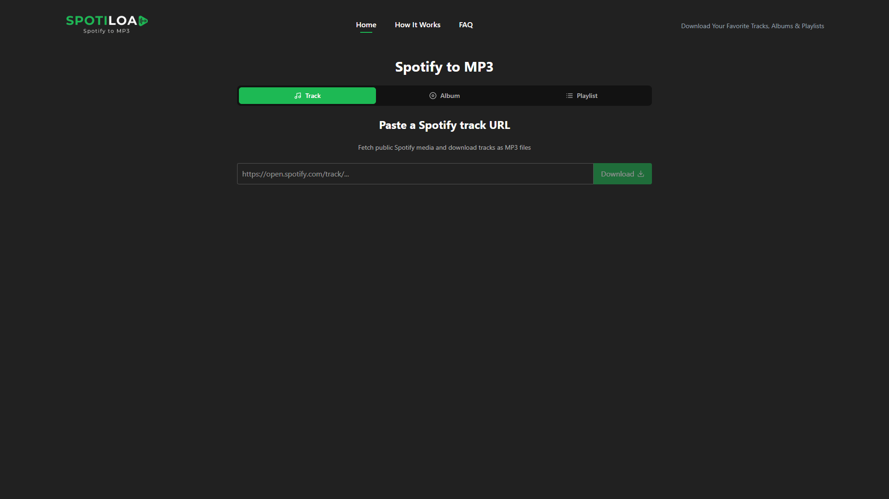
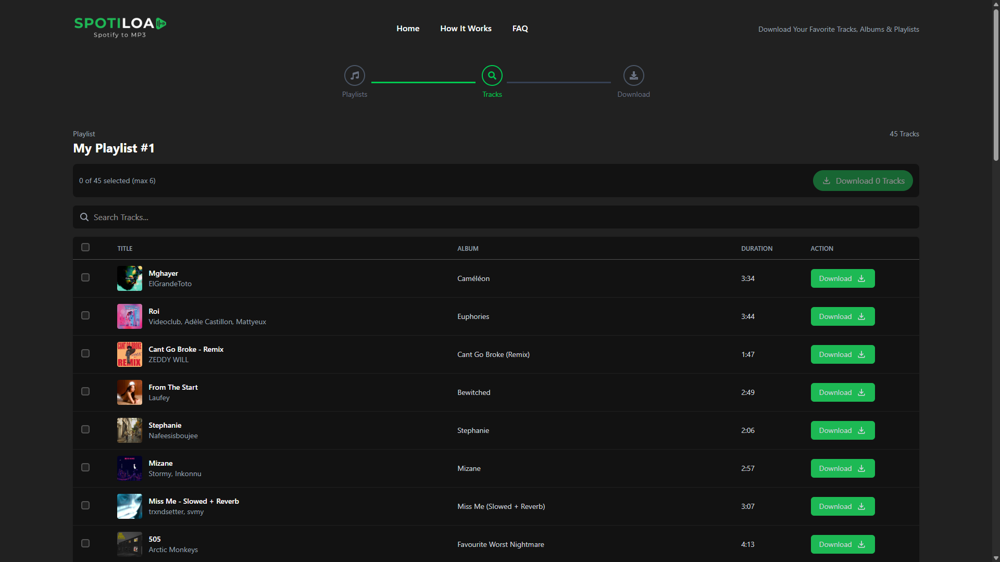
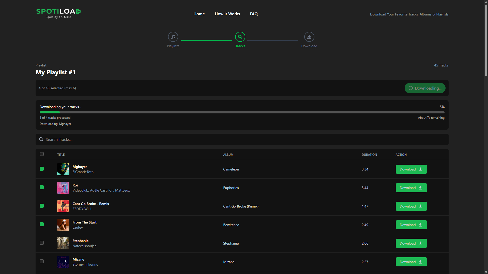
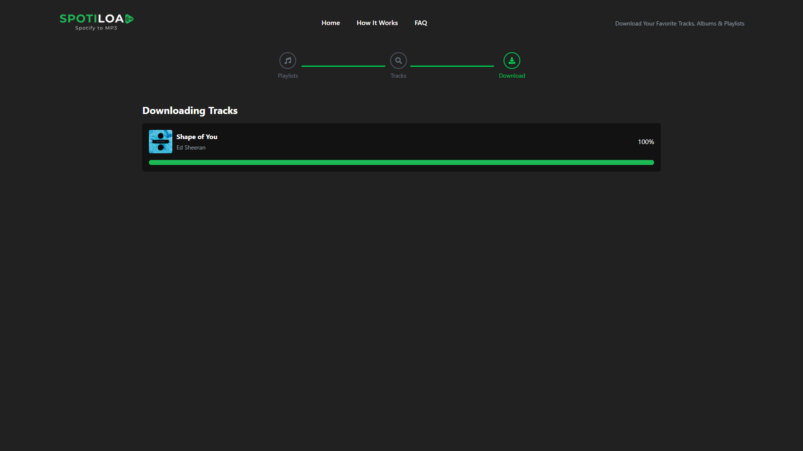

# Spotify-Downloader

<p align="center">
  
</p>

<p align="center">
  <!-- Version Badges -->
  
  
  <!-- Technology Badges -->
  
  
  
  
  
</p>

## Demo Video

[Watch the demo video](https://youtu.be/0M7XlDfTb1k)

## Description

SpotiLoad is a full-stack application for fetching public Spotify metadata and downloading matching tracks as MP3 files. Users can paste a public track, album, or playlist URL, review the available tracks, select individual tracks, or download up to six selected tracks as a ZIP archive.

### Key Features

- Public Spotify track, album, and playlist support
- No Spotify Premium account or Spotify Developer credentials required
- Responsive desktop and mobile interface
- Mobile-friendly track cards
- Individual MP3 downloads
- Checkbox-based track selection and select-all support
- Maximum of six tracks per bulk ZIP download
- ZIP progress, current-track status, and estimated remaining time
- Unicode-safe metadata and filenames
- YouTube search with `yt-dlp` and FFmpeg conversion

---

## Table of Contents

- [Installation](#installation)
- [Usage](#usage)
- [Technology Stack](#technology-stack)
- [Configuration](#configuration)
- [API Reference](#api-reference)
- [Screenshots](#screenshots)
- [Production Deployment](#production-deployment)
- [Legal Notice](#legal-notice)
- [License](#license)

---

## Installation

### Prerequisites

- Node.js 18 or newer
- npm
- Python 3.10 or newer
- FFmpeg
- Internet access

### Step-by-step Instructions

```bash
git clone https://github.com/yourusername/Spotify-Downloader.git
cd Spotify-Downloader

cd backend
npm install
py -m pip install -r python/requirements.txt

# Create backend/.env from backend/.env.example
npm run server

# In a second terminal:
cd ../frontend
npm install
npm run dev
```

---

## Usage

1. Copy a public Spotify track, album, or playlist URL.
2. Select the matching tab on the home page.
3. Paste the URL and fetch the media metadata.
4. Select the tracks you want to download.
5. Download a track individually or download up to six selected tracks as a ZIP.

## Screenshots






---

## Technology Stack

### Frontend

- React
- Vite
- React Router
- Tailwind CSS
- Axios
- Socket.IO Client
- React Icons
- Sonner

### Backend

- Node.js
- Express
- Socket.IO
- YouTube SR
- `yt-dlp`
- FFmpeg
- Archiver

### Metadata Bridge

- Python
- SpotAPI

---

## Configuration

- **Environment Variables:**
  - `backend/.env`:
    - `VITE_FRONTEND_URL`
    - `PORT`
    - `PYTHON_BIN`
    - `SPOTAPI_TIMEOUT_MS`
  - `frontend/.env`:
    - `VITE_BACKEND_URL`

- **Config Files:**
  - `backend/.env`
  - `frontend/.env`

Example backend configuration:

```env
VITE_FRONTEND_URL=http://localhost:5173
PORT=8000
PYTHON_BIN=py
SPOTAPI_TIMEOUT_MS=120000
```

On Linux or macOS, use `PYTHON_BIN=python3`.

Example frontend configuration:

```env
VITE_BACKEND_URL=http://localhost:8000
```

Do not commit `.env` files or private credentials to source control.

---

## API Reference

### Fetch Spotify Media

```http
POST /api/playlist/url
```

Request body:

```json
{
  "url": "https://open.spotify.com/track/TRACK_ID"
}
```

Returns normalized metadata for a track, album, or public playlist.

### Download an Individual Track

```http
GET /api/stream?title=Track%20Name&artist=Artist&socketId=SOCKET_ID&index=0
```

The endpoint searches for a matching audio result, converts it to MP3, and streams it to the client.

### Download Selected Tracks as ZIP

```http
POST /api/download-zip
```

Request body:

```json
{
  "tracks": [],
  "socketId": "SOCKET_ID"
}
```

The endpoint accepts a maximum of six tracks per request and emits progress events through Socket.IO.

---

## Production Deployment

A simple deployment can use Docker Compose on a VPS with HTTPS provided by Nginx, Caddy, or Cloudflare.

Recommended layout:

```text
yourdomain.com       -> frontend
api.yourdomain.com   -> backend
```

For higher traffic, move ZIP processing to a background queue such as Redis and BullMQ. Store generated archives in object storage when running multiple backend instances.

Recommended production improvements:

- Add rate limiting and request validation
- Limit concurrent `yt-dlp` processes
- Add automatic temporary-file cleanup
- Add health checks and monitoring
- Use `spawn()` argument arrays instead of shell command strings
- Run frontend, backend, and workers in separate containers

## Legal Notice

SpotiLoad does not download audio directly from Spotify. It retrieves public metadata from Spotify and searches for matching publicly available audio sources.

Users are responsible for complying with copyright laws, Spotify terms of service, YouTube terms of service, and applicable local regulations. Use this project only with content you are legally authorized to download and use.

---

## License

MIT License. See [LICENSE](LICENSE) for details.
